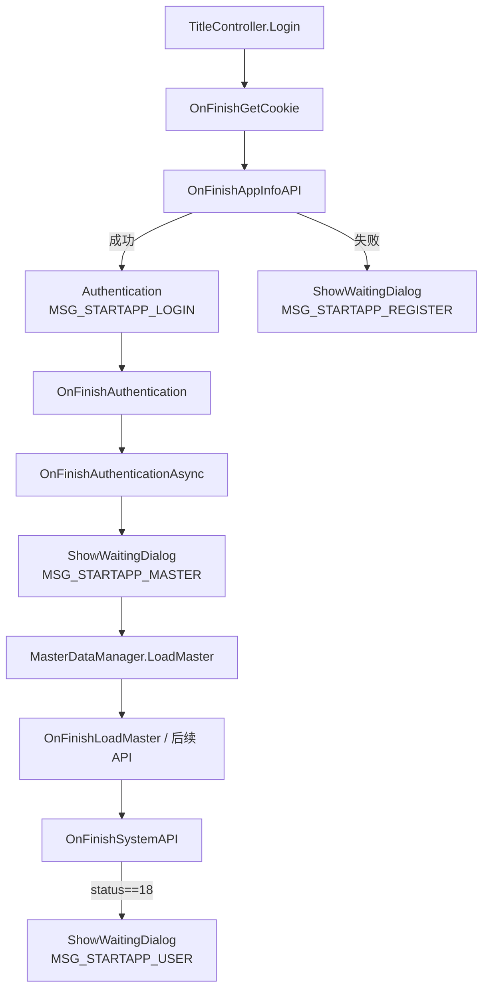

# 文本渲染组件

> 类结构来源见 [il2cpp-dump.md](./il2cpp-dump.md)。背景中的待确认项见 [bg.md](./bg.md) §3.6。

## 分析目标

确认游戏使用的文本渲染组件类型，厘清 UI 文本与剧情文本的数据来源，判断是否存在独立的振假名渲染层。

## 手段

在 `dump.cs` / `script.json` 中搜索 `TMPro`、`CustomTextMesh`、`TalkWindow`、`WordingManager`、`FontAssetManager` 等符号。

## 过程

1. 确认存在 `Unity.TextMeshPro.dll` 程序集（Image 15）。
2. 定位 UI 封装类 `Sekai.UI.CustomTextMesh`：

   ```
   CustomTextMesh : TextMeshProUGUI, ICustomText
   ```

3. 定位剧情对话框 `Sekai.TalkWindow`：
   - `nameLabel` / `nameOutlineLabel` → `CustomTextMesh`
   - `wordsLabel` / `wordsOutlineLabel` → `CustomTextMesh`
4. 定位 UI 词表系统 `Sekai.WordingManager`：
   - 静态 `Dictionary<string, string>` 存储 key → 日文文本
   - `Get(key)` / `GetFormat(key, args)` 为查找入口
5. 检查 `ruby` 字段：出现在角色 Master 数据（`MasterCharacter` 等）中，为角色名读音标注，**非**剧情对话框的独立振假名渲染层。
6. 定位字体管理 `Sekai.FontAssetManager`：
   - 管理 `_baseFontDB/EB`、`_builtInFontDB/EB`、`_dynamicFontDB/EB` 等 `TMP_FontAsset`
   - `ClearFallbackFontAsset()` 操作 fallback 表

## 结论

| 问题 | 结论 |
|------|------|
| UI 文本组件 | **TextMeshPro**，封装为 `CustomTextMesh` |
| 剧情对话框组件 | `TalkWindow` → `CustomTextMesh`（TMP 上层封装） |
| UI 文本来源 | 大量走 `WordingManager` 词表 key，非全部裸字符串 |
| 振假名层 | 无独立剧情振假名渲染层；`ruby` 为角色 Master 字段 |
| 字体 | `FontAssetManager` 管理 TMP 字体资产及 fallback 表 |

`bg.md` 中「文本渲染组件待确认」**已关闭**。

---

## 词表 key 与日文数据来源（2026-06-28）

### 分析目标

厘清 UI 词表 **key 定义在何处**、**日语文本存放在何处**，为翻译数据管线（TODO P3）提供依据。

### 手段

| 手段 | 用途 |
|------|------|
| `dump.cs` / `stringliteral.json` | 类结构、内嵌 key 字面量 |
| IDA `sub_602EC68` / `sub_4F2B2EC` / `sub_60282AC` | `AddMasterWording`、词表查找、UI 刷新链路 |
| Frida 真机样本 | 已观测 key：`MSG_STARTAPP_*`、`WORD_DECIDE` 等 |
| [sekai-master-db-diff/wordings.json](https://sekai-world.github.io/sekai-master-db-diff/wordings.json) | 社区公开 Master 词表对照 |

### 过程

#### 1. key 的三类来源

| 来源 | 说明 | 示例 |
|------|------|------|
| **C# 硬编码** | `stringliteral.json` 中 `MSG_*` / `WORD_*` 字面量，代码或运行时 `SetWordingText(key)` 传入 | `WORD_DECIDE`、`MSG_MOVIE_SKIP_BODY` |
| **Prefab 序列化** | `CustomTextMesh.wordingKey`（偏移 `0x7A0`）+ `useWordingKey`（`0x79D`）写在 UI 预制体上 | 启动画面按钮等 |
| **动态传参** | 各 UI 逻辑调用 `SetWordingText` / `SetWordingKey` | Frida 在 `SetWordingText` `onEnter` 读到 key |

`stringliteral.json` 共 **1651** 个 `MSG_*`/`WORD_*` 字面量；真机观测的 `MSG_STARTAPP_LOGIN` 等亦在此列。

#### 2. 日语文本的存放与加载

数据结构（MessagePack）：

```csharp
class MasterWording {
    [Key("wordingKey")] public string wordingKey;  // key
    [Key("value")]      public string value;       // 日文正文（可含 TMP 标签、{0} 占位符）
}
```

聚合位置：

| 容器 | 字段 | 访问入口 |
|------|------|----------|
| `SuiteMaster` | `MasterWording[] wordings` @ `0x380` | 服务端 API 分片下载 |
| `CachedMaserDataAll` | `List<MasterWording> wordings` @ `0x350` | `MasterDataManager.cachedMaster` |
| `WordingManager` | 静态 `Dictionary<string,string> dictionary` | `Get` / `GetFormat` |

加载链路（IDA 验证）：

```
登录 SystemResponse.suiteMasterSplitPath
  → MasterDataManager.LoadMaster → GetSuiteMasterAPI（MessagePack 分片）
  → UpdateMasterData → CachedMaserDataAll.wordings
  → WordingManager.AddMasterWording（0x602EC68）
       遍历 GetWordings()（0x606A988），dictionary[key]=value
  → WordingManager.Get(key)（0x60282AC）查表返回日文
```

UI 显示链路：

```
CustomTextMesh.SetWordingText(key)  // 0x4F2B408，仅存 key 到 0x7A0
  → UpdateWordingText()               // 0x4F2B2EC
       WordingManager.Get(key)        // 0x60282AC
       [可选] GetFormat + formatArgs  // 0x7C8
  → TMP set_text（tail-call）
```

**结论**：日语文本**不在** `stringliteral.json`（那里只有 key 名）；正文在 **Master 词表** `MasterWording.value`，运行时落入 `WordingManager.dictionary`。

`WordingManager.ForceInit`（`0x602E574`）在 Master 落地前通过 `Resources.Load("Wording/wording")` 加载**内置引导词表**（见下方 §6）。与 Master API 词表为**两路并行**，运行时合并进 `dictionary`。

#### 3. 外部公开词表对照

下载 `sekai-master-db-diff/wordings.json`（**3519** 条）与二进制字面量交叉比对：

| 指标 | 数量 |
|------|------|
| 二进制 `MSG_*`/`WORD_*` 字面量 | 1651 |
| 与公开库交集 | 1530 |
| 仅存在于二进制（公开库缺失） | 121 |
| 仅存在于公开库 | 1989 |

已观测 key 对照：

| key | 公开库 | 日文 value |
|-----|--------|------------|
| `WORD_DECIDE` | ✅ | 決定 |
| `WORD_CANCEL` | ✅ | キャンセル |
| `MSG_MOVIE_SKIP_BODY` | ✅ | ムービーをスキップしますか？ |
| `MSG_STARTAPP_LOGIN` | ❌ | 解包内置词表可查（§6）；完整 Master 表仍缺 |
| `MSG_STARTAPP_MASTER` | ❌ | 同上 |

`MSG_STARTAPP_*` 在公开 `wordings.json` 缺失，但 APK 内置引导词表已含日文（§6）。

#### 4. `MSG_STARTAPP_*` 来源追踪（2026-06-28）

**结论**：四个 key 均为 **`TitleController` 登录流程中硬编码的字面量**（`stringliteral.json` / IDA 数据段），**非** Prefab `wordingKey` 序列化字段。显示时经 `ShowWaitingDialog` → `StartAppWaitingDialog` → `CustomTextMesh.SetWordingText`（Frida 观测点）。

##### 调用链（显示）

```
TitleController.ShowWaitingDialog(messageKey)   @ 0x4B30218
  → WordingManager.Get(messageKey)              @ 0x60282AC（实现体；包装器 0x60241BC）
  → StartAppWaitingDialog.SetText(key)          @ 0x4B012CC
  → CustomTextMesh.SetWordingText(key)          @ 0x4F2B408  ← Frida monitor 命中处
  → UpdateWordingText → TMP set_text
```

`StartAppWaitingDialog` 挂在 `TitleController.waitingDialog`（静态字段），对应 `DialogType.StartAppWaitingDialog = 84`。

##### IDA 字面量 xref → 函数

| key | 字面量地址 | 引用函数（RVA） | 场景 |
|-----|-----------|----------------|------|
| `MSG_STARTAPP_LOGIN` | `0xB7228C8` | `TitleController.Authentication` `0x4B307E4` | 用户认证 API 进行中 |
| `MSG_STARTAPP_LOGIN` | `0xB7228C8` | `TitleController.<>c.<OnFinishAuthenticationAsync>b__31_0` `0x4B3486C` | 认证异步回调内再次弹出等待框 |
| `MSG_STARTAPP_MASTER` | `0xB7228D0` | `TitleController.<OnFinishAuthenticationAsync>d__31.MoveNext` `0x4B35220` | **Master 数据下载前**更新等待文案 |
| `MSG_STARTAPP_REGISTER` | `0xB7228D8` | `TitleController.OnFinishAppInfoAPI` `0x4B30780` | AppInfo API 失败分支 |
| `MSG_STARTAPP_USER` | `0xB7228E0` | `TitleController.OnFinishSystemAPI` `0x4B30F24` | System API 返回 status `0x12`（18）时 |

`MSG_STARTAPP_MASTER` 引用点后紧跟 `MasterDataManager.LoadMaster`（`0x604E5B0`）调用，与真机「正在下载数据」阶段一致。

##### 标题登录状态机（简化）



##### 日文正文从哪来

- **key 定义**：编译进 `libil2cpp.so` 的 C# 字面量（`TitleController` 登录管线）。
- **日文 value（启动阶段）**：内置引导词表 `Wording/wording`（§6），`ForceInit` 在 `LoadMaster` 前即可提供 `MSG_STARTAPP_*` 等约 196 条。
- **日文 value（全量 UI）**：`LoadMaster` 后 `AddMasterWording` 合并 `MasterWording` 表（约 3500+ 条）。

#### 5. 解包获取词表（不依赖 sekai-master-db-diff）（2026-06-28，暂缓脚本化）

##### 分析目标

评估能否仅靠 **APK / 设备解包** 得到 `wordings.json` 等价物，而不依赖社区 `sekai-master-db-diff` 仓库。

##### 手段

解包 `split_UnityDataAssetPack.apk`；IDA 追 `WordingManager.ForceInit`；`adb pull` 设备 Master 缓存。

##### 过程

1. **IDA**：`ForceInit` @ `0x602E574` 在 `AddMasterWording` 之前调用 `Resources.Load("Wording/wording")` @ `0x6EA88F8`，再按逗号 `0x2C` 解析 CSV 写入 `dictionary`。
2. **APK 解包**：内置资源不在独立 `Wording/` 目录，而在 Unity 序列化块：
   - 路径：`apk/split_UnityDataAssetPack.apk` → `assets/bin/Data/112b24b5d05c9446b9dc9a758f423bbd`（17 588 B）
   - 格式：`wordingKey,日文value` 交替，条目以 `\n` 分隔；示例：
     - `MSG_STARTAPP_LOGIN` → `ゲームにログインしています。`
     - `MSG_STARTAPP_MASTER` → `必要なデータを取得しています。`
     - `MSG_STARTAPP_REGISTER` → `ユーザーを作成しています。`
     - `MSG_STARTAPP_USER` → `プロジェクトセカイにようこそ。`
   - 统计：**196** 条唯一 `MSG_*`/`WORD_*`（含全部 4 个 `MSG_STARTAPP_*`）；**无** `WORD_DECIDE` 等菜单词（那些只在 Master 表）。
3. **全量 Master 词表**：**不在 APK 明文**。登录后写入设备缓存：
   - 目录：`/sdcard/Android/data/com.sega.pjsekai/files/p6FeKw3CVfhD2S5E/`（= `MasterDataManager.sizeoffs`）
   - 主文件：`YUHXZyDBFcwbeeFD`（= `MasterDataManager.temp`，约 126 MB）
   - 加密：`FastAESCrypt`；pull 样本（`dump/tmp/master_cache`）内搜不到 `wordingKey` / `MSG_STARTAPP` 明文
   - 另有 `snippets/` 分片（Base64 类名文件名）
4. **运行时 CDN**：`suiteMasterSplitPath` → `GetSuiteMasterAPI` 分片下载 MessagePack `SuiteMaster.wordings`（与 diff 仓库来源同类，需抓包或 `sekai-assets-updater` 类工具）。

##### 结论

| 数据源 | 能否解包拿到 | 覆盖范围 | 备注 |
|--------|-------------|----------|------|
| 内置 `Wording/wording` | ✅ | ~196 条引导/UI 错误/登录文案 | APK 解包即可；**不等价**于完整 `wordings.json` |
| Master 缓存 `YUHXZyDBFcwbeeFD` | ⏳ 需解密 | 全量 `wordings` | 真机 pull 已验证路径；`FastAESCrypt` 密钥待逆向 |
| `suiteMaster` CDN 分片 | ⏳ 需下载+解析 | 全量 | 不依赖 diff 仓库，但需 API 路径与 MessagePack 管线 |
| `sekai-master-db-diff` | ✅ 直接用 | 3519 条（滞后于最新版） | 社区已解密整理，维护成本最低 |

**实践建议（暂缓）**：Mod 翻译管线可先用内置 196 条覆盖启动/错误文案；全量 UI 仍须 Master 解密或社区 diff。

#### 6. 与剧情文本的区分

| 类型 | 数据形态 | Hook 点 |
|------|----------|---------|
| **UI 词表** | key → `MasterWording.value` | `SetWordingText` / `WordingManager.Get` / `TMP_Text.set_text` |
| **剧情对话** | 明文（角色名 + 正文） | `TalkWindow.SetWordsInfo`；数据来自 scenario JSON，**不走词表 key** |

### 结论

| 问题 | 结论 |
|------|------|
| key 在哪 | 代码字面量 + Prefab `wordingKey` 字段 + 运行时 `SetWordingText` 传参 |
| 日文在哪 | `MasterWording.value`，经 `MasterDataManager` 加载后写入 `WordingManager.dictionary` |
| 离线数据源 | 全量：`sekai-master-db-diff` 或解密 Master 缓存；启动文案：解包 `112b24b5…` 内置词表（196 条） |
| 翻译接入点 | 在 `WordingManager.Get` 或 `TMP_Text.set_text` 用 `key → 中文` 替换；剧情走 `SetWordsInfo` 独立映射 |

## 相关笔记

- Hook 方案：[hook-strategy.md](./hook-strategy.md)
- IDA 函数验证：[ida-verification.md](./ida-verification.md)