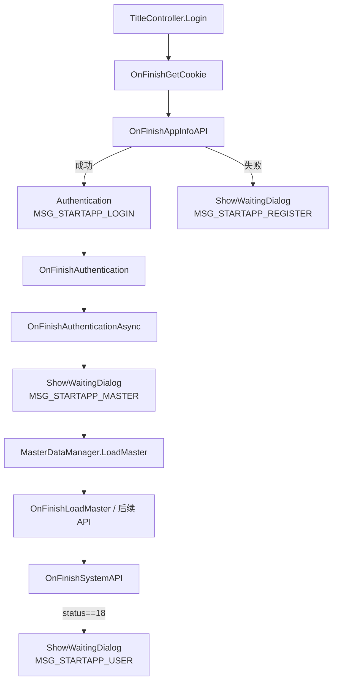

# 文本渲染组件

> 类结构来源见 [il2cpp-dump.md](./il2cpp-dump.md)。背景中的待确认项见 [bg.md](./bg.md) §3.6。

## 分析目标

确认游戏使用的文本渲染组件类型，厘清 UI 文本与剧情文本的数据来源，判断是否存在独立的振假名渲染层。

## 手段

在 `dump.cs` / `script.json` 中搜索 `TMPro`、`CustomTextMesh`、`TalkWindow`、`WordingManager`、`FontAssetManager` 等符号。

## 过程

1. 确认存在 `Unity.TextMeshPro.dll` 程序集（Image 15）。
2. 定位 UI 封装类 `Sekai.UI.CustomTextMesh`：

   ```
   CustomTextMesh : TextMeshProUGUI, ICustomText
   ```

3. 定位剧情对话框 `Sekai.TalkWindow`：
   - `nameLabel` / `nameOutlineLabel` → `CustomTextMesh`
   - `wordsLabel` / `wordsOutlineLabel` → `CustomTextMesh`
4. 定位 UI 词表系统 `Sekai.WordingManager`：
   - 静态 `Dictionary<string, string>` 存储 key → 日文文本
   - `Get(key)` / `GetFormat(key, args)` 为查找入口
5. 检查 `ruby` 字段：出现在角色 Master 数据（`MasterCharacter` 等）中，为角色名读音标注，**非**剧情对话框的独立振假名渲染层。
6. 定位字体管理 `Sekai.FontAssetManager`：
   - 管理 `_baseFontDB/EB`、`_builtInFontDB/EB`、`_dynamicFontDB/EB` 等 `TMP_FontAsset`
   - `ClearFallbackFontAsset()` 操作 fallback 表

## 结论

| 问题 | 结论 |
|------|------|
| UI 文本组件 | **TextMeshPro**，封装为 `CustomTextMesh` |
| 剧情对话框组件 | `TalkWindow` → `CustomTextMesh`（TMP 上层封装） |
| UI 文本来源 | 大量走 `WordingManager` 词表 key，非全部裸字符串 |
| 振假名层 | 无独立剧情振假名渲染层；`ruby` 为角色 Master 字段 |
| 字体 | `FontAssetManager` 管理 TMP 字体资产及 fallback 表 |

`bg.md` 中「文本渲染组件待确认」**已关闭**。

---

## 初步汉化字体策略（2026-06-29）

### 分析目标

确定初步汉化阶段如何避免简中 tofu，同时保证简体字形一致（非日文汉字形混搭）。

### 手段

- 真机 `font` 探测：`SetupBuiltinFontAsset` / `ClearFallbackFontAsset` 调用顺序与 `FontAssetManager` 字段（见 [frida.md](./frida.md) §7、[ida-verification.md](./ida-verification.md)）
- TMP 渲染语义：主字体 atlas 有字形则**不**查 fallback
- 思源黑体区域子集对照：SC vs JP 字形差异

### 过程

1. 日服内置主字体为 **`EB`** / **`DB`**（`FontAssetManager+0x20` / `+0x38`），glyph 按日文设计。
2. 初版 Frida 原型向 `[font+0x138]` fallback List **追加**思源 SC — 仅当主字体**缺字**时生效。
3. 大量中日共用码位在日文字体中**已有字形**（日文写法）→ 简中翻译仍显示日文形；仅简体专用字（设、说、网等）才落到 fallback。
4. **思源黑体 SC**（`SourceHanSansSC`）：主力为**简体汉字**（中国字形），通常含平假名/片假名，**不含**日文汉字形；未翻译日文可由 EB/DB fallback 显示。
5. 定案：初步汉化采用**替换主字体**，而非 fallback 补字。

### 结论

| 项 | 结论 |
|----|------|
| 初步汉化策略 | **替换**：`SetupBuiltinFontAsset` onLeave 将 EB/DB 换为 SC `TMP_FontAsset` |
| 原 EB/DB 去向 | 降级为新字体的 **fallback**，兜底 gap 日文、假名、日字特化形 |
| 字体资产来源 | 优先 **思源 SC 子集**（charset 烘焙）；备选国服 CN 同名 TMP bundle |
| 弃用方案 | 日文字体主 + fallback 追加 — 只解决 tofu，不解决字形区域错误 |
| 不适用路径 | legacy `CustomText`（Unity `Text`）不走 TMP fallback，需单独处理 |
| 实现状态 | `frida/lib/font_inject.js`：`FONT_MODE=replace` 替换主字体；`dual` 仅预加载 SC |

Hook 细节见 [hook-strategy.md](./hook-strategy.md) §字体替换挂点。

### 双语混排（剧情双字幕）时的字体策略

与「全 UI / 单行剧情简中」不同：双字幕**同一屏同时出现日文与中文**，不能把全局主字体简单替换成思源 SC。

| 场景 | 字体策略 |
|------|----------|
| UI 简中 / 剧情 `STORY_MODE=cn` | 全局替换 EB/DB → SC 主字体；EB/DB 作 fallback |
| 剧情 `STORY_MODE=dual` | **按行 / 按 label 分字体**；禁止依赖单主字体 + fallback 混排 |

**根因**：TMP 逐字查字形——主字体 atlas **有该码位即用主字体形**，不区分「这句是日文还是中文」。单 label 内混排时：

- SC 主 + EB/DB fallback：简中行正确；日文行里的**共用汉字**仍显示**中国形** ❌
- EB/DB 主 + SC fallback：日文行正确；简中行里的共用汉字显示**日本形** ❌

**推荐（与 [dual-subtitle.md](./dual-subtitle.md) 双 label 方向一致）**：

1. **物理双 label**：`wordsLabel`（或打字机 label）只显示日文 → 保持 **EB/DB**；译文 label 显示简中 → 绑定 **思源 SC**（`TMP_Text.font` 或运行时挂节点）。
2. **两阶段 + 富文本 `<font>`**（打字完成后再写译文）：整串默认 EB/DB，译文段包 `<font="SourceHanSansSC-Regular SDF">…</font>`；两资产须已加载。打字过程中仍不可用 rich（标签会被逐字打出）。
3. **妥协（不推荐）**：单 label 混排 + SC 主 / EB fallback — 仅假名与缺字回落日文，共用汉字日文行仍不对。

运行时须**同时驻留** SC 与 EB/DB 两份 `TMP_FontAsset`（全局替换策略在 dual 模式下应**关闭**或仅作用于 UI label）。

---

## 词表 key 与日文数据来源（2026-06-28）

### 分析目标

厘清 UI 词表 **key 定义在何处**、**日语文本存放在何处**，为翻译数据管线（TODO P3）提供依据。

### 手段

| 手段 | 用途 |
|------|------|
| `dump.cs` / `stringliteral.json` | 类结构、内嵌 key 字面量 |
| IDA `sub_602EC68` / `sub_4F2B2EC` / `sub_60282AC` | `AddMasterWording`、词表查找、UI 刷新链路 |
| Frida 真机样本 | 已观测 key：`MSG_STARTAPP_*`、`WORD_DECIDE` 等 |
| [sekai-master-db-diff/wordings.json](https://sekai-world.github.io/sekai-master-db-diff/wordings.json) | 社区公开 Master 词表对照 |

### 过程

#### 1. key 的三类来源

| 来源 | 说明 | 示例 |
|------|------|------|
| **C# 硬编码** | `stringliteral.json` 中 `MSG_*` / `WORD_*` 字面量，代码或运行时 `SetWordingText(key)` 传入 | `WORD_DECIDE`、`MSG_MOVIE_SKIP_BODY` |
| **Prefab 序列化** | `CustomTextMesh.wordingKey`（偏移 `0x7A0`）+ `useWordingKey`（`0x79D`）写在 UI 预制体上 | 启动画面按钮等 |
| **动态传参** | 各 UI 逻辑调用 `SetWordingText` / `SetWordingKey` | Frida 在 `SetWordingText` `onEnter` 读到 key |

`stringliteral.json` 共 **1651** 个 `MSG_*`/`WORD_*` 字面量；真机观测的 `MSG_STARTAPP_LOGIN` 等亦在此列。

#### 2. 日语文本的存放与加载

数据结构（MessagePack）：

```csharp
class MasterWording {
    [Key("wordingKey")] public string wordingKey;  // key
    [Key("value")]      public string value;       // 日文正文（可含 TMP 标签、{0} 占位符）
}
```

聚合位置：

| 容器 | 字段 | 访问入口 |
|------|------|----------|
| `SuiteMaster` | `MasterWording[] wordings` @ `0x380` | 服务端 API 分片下载 |
| `CachedMaserDataAll` | `List<MasterWording> wordings` @ `0x350` | `MasterDataManager.cachedMaster` |
| `WordingManager` | 静态 `Dictionary<string,string> dictionary` | `Get` / `GetFormat` |

加载链路（IDA 验证）：

```
登录 SystemResponse.suiteMasterSplitPath
  → MasterDataManager.LoadMaster → GetSuiteMasterAPI（MessagePack 分片）
  → UpdateMasterData → CachedMaserDataAll.wordings
  → WordingManager.AddMasterWording（0x602EC68）
       遍历 GetWordings()（0x606A988），dictionary[key]=value
  → WordingManager.Get(key)（0x60282AC）查表返回日文
```

UI 显示链路：

```
CustomTextMesh.SetWordingText(key)  // 0x4F2B408，仅存 key 到 0x7A0
  → UpdateWordingText()               // 0x4F2B2EC
       WordingManager.Get(key)        // 0x60282AC
       [可选] GetFormat + formatArgs  // 0x7C8
  → TMP set_text（tail-call）
```

**结论**：日语文本**不在** `stringliteral.json`（那里只有 key 名）；正文在 **Master 词表** `MasterWording.value`，运行时落入 `WordingManager.dictionary`。

`WordingManager.ForceInit`（`0x602E574`）在 Master 落地前通过 `Resources.Load("Wording/wording")` 加载**内置引导词表**（见下方 §6）。与 Master API 词表为**两路并行**，运行时合并进 `dictionary`。

#### 3. 外部公开词表对照

下载 `sekai-master-db-diff/wordings.json`（**3519** 条）与二进制字面量交叉比对：

| 指标 | 数量 |
|------|------|
| 二进制 `MSG_*`/`WORD_*` 字面量 | 1651 |
| 与公开库交集 | 1530 |
| 仅存在于二进制（公开库缺失） | 121 |
| 仅存在于公开库 | 1989 |

已观测 key 对照：

| key | 公开库 | 日文 value |
|-----|--------|------------|
| `WORD_DECIDE` | ✅ | 決定 |
| `WORD_CANCEL` | ✅ | キャンセル |
| `MSG_MOVIE_SKIP_BODY` | ✅ | ムービーをスキップしますか？ |
| `MSG_STARTAPP_LOGIN` | ❌ | 解包内置词表可查（§6）；完整 Master 表仍缺 |
| `MSG_STARTAPP_MASTER` | ❌ | 同上 |

`MSG_STARTAPP_*` 在公开 `wordings.json` 缺失，但 APK 内置引导词表已含日文（§6）。

#### 4. `MSG_STARTAPP_*` 来源追踪（2026-06-28）

**结论**：四个 key 均为 **`TitleController` 登录流程中硬编码的字面量**（`stringliteral.json` / IDA 数据段），**非** Prefab `wordingKey` 序列化字段。显示时经 `ShowWaitingDialog` → `StartAppWaitingDialog` → `CustomTextMesh.SetWordingText`（Frida 观测点）。

##### 调用链（显示）

```
TitleController.ShowWaitingDialog(messageKey)   @ 0x4B30218
  → WordingManager.Get(messageKey)              @ 0x60282AC（实现体；包装器 0x60241BC）
  → StartAppWaitingDialog.SetText(key)          @ 0x4B012CC
  → CustomTextMesh.SetWordingText(key)          @ 0x4F2B408  ← Frida monitor 命中处
  → UpdateWordingText → TMP set_text
```

`StartAppWaitingDialog` 挂在 `TitleController.waitingDialog`（静态字段），对应 `DialogType.StartAppWaitingDialog = 84`。

##### IDA 字面量 xref → 函数

| key | 字面量地址 | 引用函数（RVA） | 场景 |
|-----|-----------|----------------|------|
| `MSG_STARTAPP_LOGIN` | `0xB7228C8` | `TitleController.Authentication` `0x4B307E4` | 用户认证 API 进行中 |
| `MSG_STARTAPP_LOGIN` | `0xB7228C8` | `TitleController.<>c.<OnFinishAuthenticationAsync>b__31_0` `0x4B3486C` | 认证异步回调内再次弹出等待框 |
| `MSG_STARTAPP_MASTER` | `0xB7228D0` | `TitleController.<OnFinishAuthenticationAsync>d__31.MoveNext` `0x4B35220` | **Master 数据下载前**更新等待文案 |
| `MSG_STARTAPP_REGISTER` | `0xB7228D8` | `TitleController.OnFinishAppInfoAPI` `0x4B30780` | AppInfo API 失败分支 |
| `MSG_STARTAPP_USER` | `0xB7228E0` | `TitleController.OnFinishSystemAPI` `0x4B30F24` | System API 返回 status `0x12`（18）时 |

`MSG_STARTAPP_MASTER` 引用点后紧跟 `MasterDataManager.LoadMaster`（`0x604E5B0`）调用，与真机「正在下载数据」阶段一致。

##### 标题登录状态机（简化）



##### 日文正文从哪来

- **key 定义**：编译进 `libil2cpp.so` 的 C# 字面量（`TitleController` 登录管线）。
- **日文 value（启动阶段）**：内置引导词表 `Wording/wording`（§6），`ForceInit` 在 `LoadMaster` 前即可提供 `MSG_STARTAPP_*` 等约 196 条。
- **日文 value（全量 UI）**：`LoadMaster` 后 `AddMasterWording` 合并 `MasterWording` 表（约 3500+ 条）。

#### 5. 解包获取词表（不依赖 sekai-master-db-diff）（2026-06-28，暂缓脚本化）

##### 分析目标

评估能否仅靠 **APK / 设备解包** 得到 `wordings.json` 等价物，而不依赖社区 `sekai-master-db-diff` 仓库。

##### 手段

解包 `split_UnityDataAssetPack.apk`；IDA 追 `WordingManager.ForceInit`；`adb pull` 设备 Master 缓存。

##### 过程

1. **IDA**：`ForceInit` @ `0x602E574` 在 `AddMasterWording` 之前调用 `Resources.Load("Wording/wording")` @ `0x6EA88F8`，再按逗号 `0x2C` 解析 CSV 写入 `dictionary`。
2. **APK 解包**：内置资源不在独立 `Wording/` 目录，而在 Unity 序列化块：
   - 路径：`apk/split_UnityDataAssetPack.apk` → `assets/bin/Data/112b24b5d05c9446b9dc9a758f423bbd`（17 588 B）
   - 格式：`wordingKey,日文value` 交替，条目以 `\n` 分隔；示例：
     - `MSG_STARTAPP_LOGIN` → `ゲームにログインしています。`
     - `MSG_STARTAPP_MASTER` → `必要なデータを取得しています。`
     - `MSG_STARTAPP_REGISTER` → `ユーザーを作成しています。`
     - `MSG_STARTAPP_USER` → `プロジェクトセカイにようこそ。`
   - 统计：**196** 条唯一 `MSG_*`/`WORD_*`（含全部 4 个 `MSG_STARTAPP_*`）；**无** `WORD_DECIDE` 等菜单词（那些只在 Master 表）。
3. **全量 Master 词表**：**不在 APK 明文**。登录后写入设备缓存：
   - 目录：`/sdcard/Android/data/com.sega.pjsekai/files/p6FeKw3CVfhD2S5E/`（= `MasterDataManager.sizeoffs`）
   - 主文件：`YUHXZyDBFcwbeeFD`（= `MasterDataManager.temp`，约 126 MB）
   - 加密：`FastAESCrypt`；pull 样本（`dump/tmp/master_cache`）内搜不到 `wordingKey` / `MSG_STARTAPP` 明文
   - 另有 `snippets/` 分片（Base64 类名文件名）
4. **运行时 CDN**：`suiteMasterSplitPath` → `GetSuiteMasterAPI` 分片下载 MessagePack `SuiteMaster.wordings`（与 diff 仓库来源同类，需抓包或 `sekai-assets-updater` 类工具）。

##### 结论

| 数据源 | 能否解包拿到 | 覆盖范围 | 备注 |
|--------|-------------|----------|------|
| 内置 `Wording/wording` | ✅ | ~196 条引导/UI 错误/登录文案 | APK 解包即可；**不等价**于完整 `wordings.json` |
| Master 缓存 `YUHXZyDBFcwbeeFD` | ⏳ 需解密 | 全量 `wordings` | 真机 pull 已验证路径；`FastAESCrypt` 密钥待逆向 |
| `suiteMaster` CDN 分片 | ⏳ 需下载+解析 | 全量 | 不依赖 diff 仓库，但需 API 路径与 MessagePack 管线 |
| `sekai-master-db-diff` | ✅ 直接用 | 3519 条（滞后于最新版） | 社区已解密整理，维护成本最低 |

**实践建议（暂缓）**：Mod 翻译管线可先用内置 196 条覆盖启动/错误文案；全量 UI 仍须 Master 解密或社区 diff。

#### 6. 与剧情文本的区分

| 类型 | 数据形态 | Hook 点 |
|------|----------|---------|
| **UI 词表** | key → `MasterWording.value` | `SetWordingText` / `WordingManager.Get` / `TMP_Text.set_text` |
| **剧情对话** | 明文（角色名 + 正文） | `TalkWindow.SetWordsInfo`；数据来自 scenario JSON，**不走词表 key** |

### 结论

| 问题 | 结论 |
|------|------|
| key 在哪 | 代码字面量 + Prefab `wordingKey` 字段 + 运行时 `SetWordingText` 传参 |
| 日文在哪 | `MasterWording.value`，经 `MasterDataManager` 加载后写入 `WordingManager.dictionary` |
| 离线数据源 | 全量：`sekai-master-db-diff` 或解密 Master 缓存；启动文案：解包 `112b24b5…` 内置词表（196 条） |
| 翻译接入点 | 在 `WordingManager.Get` 或 `TMP_Text.set_text` 用 `key → 中文` 替换；剧情走 `SetWordsInfo` 独立映射 |

---

## 翻译数据管线与国服词表（2026-06-28）

### 分析目标

评估汉化 Mod 的数据存储形态，以及能否直接复用国服（简中）官方译文。

### 手段

- Sekai-World 多区 Master diff：`sekai-master-db-diff`（日）、`sekai-master-db-cn-diff`（简中国服）
- 在线 JSON：`https://sekai-world.github.io/sekai-master-db-{cn-,}diff/wordings.json`
- JP/CN `wordingKey` 交集统计；与 Frida 已观测 key 交叉核对
- `sekai-assets-updater` 文档（支持 `REGION: CN` 拉取剧情 AssetBundle）

### 过程

**1. 国服词表可直接作 UI 主数据源**

CN diff 与日服 diff **同一 schema**：`{ wordingKey, value }`。2026-06-28 快照统计：

| 指标 | 日服 JP | 国服 CN |
|------|---------|---------|
| 条数 | 3519 | 4838 |
| key 交集 | — | **3213** |
| 仅日服有 | 306 | — |
| 仅国服有 | — | 1625（防沉迷 `AntiAddiction_*`、Nuverse 合规文案等） |

已验证 Frida 样本在 CN 库均有对应译文：

| key | 日服 value | 国服 value |
|-----|------------|------------|
| `WORD_DECIDE` | 決定 | 确定 |
| `WORD_CANCEL` | キャンセル | 取消 |
| `MSG_LIVE_SKIP_BODY` | ライブをスキップしますか？ | 是否跳过演出？ |

**2. 不能「整包照搬」的缺口**

| 缺口 | 说明 |
|------|------|
| `MSG_STARTAPP_*` | JP/CN 公开 diff **均缺失**；日文来自 APK 内置 196 条（§5）；国服需解包国服 APK 内置词表或手翻 |
| 日服独有 306 key | 日服客户端仍会 lookup，CN diff 无条目 → 需 fallback（留日文 / 社区补翻） |
| 版本不同步 | 国服、日服活动与 Master 更新节奏不同；diff 快照须与目标 `versionName` 对齐 |
| `GetFormat` 占位符 | CN 库约 521 条含 `{0}`、约 25 条含 `%s`/`%d`；约 207 条含 TMP 富文本标签；替换时须原样保留占位符与标签 |
| 剧情明文 | **不走 `wordingKey`**；`SetWordsInfo` 直接给角色名+正文；CN diff 的 `wordings.json` **不覆盖剧情** |

**3. 剧情译文来源（独立于 wordings）**

- 日服剧情素材：sekai.best / `sekai-assets-updater`（`REGION: JP`）解出的 scenario / unitystory JSON
- 国服剧情：`sekai-assets-updater` 设 `REGION: CN`（README 支持 CN/TW/KR/EN），拉取国服 AssetBundle 后提取 scenario JSON
- 对齐方式：按剧情资源 ID / scenario 结构字段（非 `wordingKey`）建立 `lineId` 或「原文 hash → 中文」表；日服与国服剧情版本可能不一致，需按章节版本绑定

**4. 推荐 Mod 翻译包结构（草案）**

```
i18n/
├── manifest.json          # gameVersion, cn_diff_rev, checksum, locale=zh-Hans
├── ui/
│   └── wordings.json      # wordingKey → zh（主表，来源 CN diff）
├── ui/
│   └── overrides.json     # 日服独有 key、MSG_STARTAPP_* 等补丁
├── fmt/                   # 可选：GetFormat 专用，校验 {0}/%s 与原文一致
└── story/
    └── *.json             # episode/scenarioId → [{jp, zh, speaker?}]
```

运行时 lookup：

| Hook 点 | 查表键 | 数据源 |
|---------|--------|--------|
| `WordingManager.Get` / `GetFormat` | `wordingKey` | `ui/wordings.json` + overrides |
| `SetWordingText`（monitor） | key | 同上 |
| `TalkWindow.SetWordsInfo` | 正文 hash 或 scenario lineId | `story/*.json` |

热更新：整包替换 `i18n/` 目录 + `manifest.json` 版本校验（TODO P3 待细化）。

### 结论

- **UI 词表：可以且应该优先用国服 CN diff**（`sekai-master-db-cn-diff`），按 `wordingKey` 直接 lookup，工程成本最低、译文为官方简中。
- **不能指望 CN diff  alone**：内置 196 条、日服独有 key、剧情明文须另管线；版本须与日服客户端对齐并做缺失检测。
- **剧情**：需 `sekai-assets-updater` `REGION=CN` 或等价国服 scenario 提取，与 UI 词表分开存储。
- **合规**：国服译文属官方资产，Mod 分发时需自行评估版权与使用范围（技术可行 ≠ 可随意再分发）。

---

## 剧情文本能否直接挪用国服（2026-06-28）

### 分析目标

评估日服客户端 Mod 能否**直接复用国服官方剧情译文**（仅 CN 已有的部分），以及可行对齐方式与缺口。

### 手段

- `dump.cs`：`ScenarioSceneData`、`ScenarioSnippetTalk`、`TalkWindow.SetWordsInfo`、`ScenarioPlayer.SnippetActionTalk`
- Sekai-World Master diff（JP / CN）交叉统计 `scenarioId`
- `sekai-assets-updater` 多区 `REGION` 文档

### 过程

#### 1. 剧情与 UI 词表是两条管线

| 维度 | UI 词表 | 剧情 |
|------|---------|------|
| 数据源 | `MasterWording` / `wordings.json` | AssetBundle 内 `ScenarioSceneData` JSON |
| 运行时入口 | `WordingManager.Get(key)` | `ScenarioPlayer` → `TalkWindow.SetWordsInfo(name, body)` |
| CN diff 是否覆盖 | ✅ `wordings.json` | ❌ 不含对话正文 |

剧情单句结构（`ScenarioSnippetTalk`）：

```
WindowDisplayName  — 对话框显示名（可与 Master 角色名不同）
Body               — 正文（含 \n、{{playerName}} 等）
ReferenceIndex     — 由 ScenarioSnippet 引用进 Snippets 序列
```

`ScenarioPlayer` 常量 `REPLACE_CODE_USERNAME = "{{playerName}}"`，替换发生在播放前。

#### 2. 「挪用」指什么

| 做法 | 可行性 | 说明 |
|------|--------|------|
| 把国服 scenario AssetBundle 塞进日服客户端 | ❌ | 包名/加密/版本与 JP 服绑定；不能当「换包」 |
| 提取国服 scenario JSON 的**中文文本**，日服运行时 Hook 替换 | ✅ | 与 UI 词表同理，只借**译文串**，不换资源包 |
| 用国服 `wordings.json` 覆盖剧情 | ❌ | 剧情不走 `wordingKey` |

#### 3. CN 有哪些、JP 多哪些（Master diff 快照）

| 内容 | 日服 | 国服 | 共有 `scenarioId` | 仅日服 |
|------|------|------|-------------------|--------|
| 活动剧情集 `eventStories` | 1688 话 | 1498 话 | **1498** | 190 |
| 活动 `events` | 208 | 182 | 182 | 26 |
| 卡片剧情 `cardEpisodes` | 2670 | 2384 | **2384** | 286 |

共有集的 **`scenarioId` 字符串在日/CN Master 中一致**（例如 `event_01_01`），可作为对齐主键。

曲名等 Master 字段日/CN 多为同一字符串；**活动话标题**几乎全不同（如 `ひとりぼっちの雨模様` → `孤独的雨`），说明剧情正文确需单独拉 scenario JSON，不能靠 Master 表代替。

#### 4. 对齐策略（按推荐顺序）

**A. `scenarioId` + 行序（首选）**

1. `sekai-assets-updater` 分别 `REGION=JP` / `REGION=CN` 解包 scenario
2. 解析 `ScenarioSceneData`：`TalkData[]` + `Snippets[]` 中 `Action=Talk` 的 `ReferenceIndex`
3. 对共有 `scenarioId`，按 **talk 行下标** 建立 `jp_body → cn_body`、`jp_displayName → cn_displayName`
4. 校验：JP/CN 该 scenario 的 Talk 条数一致；不一致则记入 gap-report，该行 fallback 日文

**B. 日文明文 hash lookup（实现快，与 `plain-text.json` 同构）**

- 在 `SetWordsInfo` `onEnter` 用 `body` / `displayName` 查表
- 优点：无需 Hook `ScenarioPlayer`；可复用已有 `lookupUiPlain` 模式
- 缺点：同名台词/重复句会对齐歧义；`{{playerName}}` 展开前后文本不同，需规范化为占位符再查

**C. 运行时上下文（精度最高）**

- `SetWordsInfo` **没有** `scenarioId` 参数（仅 `characterId, displayName, words, …`）
- 可在 `ScenarioPlayer.SnippetActionTalk` @ `0x6244D80` 设线程上下文 `(scenarioId, lineIndex)`，再供 `SetWordsInfo` 查 `story/{scenarioId}.json[line]`
- Zygisk 量产推荐 A 预构建 + C 作校验

#### 5. 与现有 Hook / 数据的衔接

| 字段 | 来源 | 备注 |
|------|------|------|
| 角色 `displayName` | scenario `WindowDisplayName` 或 Master 名 | 可与 `plain-text.json`（`gameCharacters`）部分重叠 |
| 正文 `body` | scenario `TalkData[].Body` | 必须来自 CN scenario 提取 |
| 语音 | JP bundle 不变 | 替换文本后仍是日语音轨，属预期 |

当前 `intercept.js` 剧情路径：`STORY_MODE=prefix` + 硬编码 `DEMO_ZH`；接入国服应改为 `story/*.json` 或合并进专用 `story-text.json`。

### 结论

| 问题 | 结论 |
|------|------|
| CN 有的剧情能否直接用？ | **能**，指复用**国服官方中文台词**（scenario JSON），不是换 CN 资源包 |
| 覆盖大概多少？ | 活动 **1498** + 卡片 **2384** 个 `scenarioId` 有 CN 源；另有 **190+286** 话仅日服，需 fallback |
| 和 UI 词表能否共用一张表？ | **不能**；剧情独立 `i18n/story/`，Hook 仍是 `SetWordsInfo` |
| 最小可行路径 | assets-updater 拉 CN scenario → 按 `scenarioId`+行序生成 `jp→zh` → `SetWordsInfo` 替换 |
| 主要风险 | 版本漂移（行数不一致）、JP 独占剧情、占位符与富文本、CJK 字体 |

**下一步（游戏下载前可准备）**：在 `i18n-tools` 增加 `story` 构建子命令；Master diff 生成「共有 / 仅日服 `scenarioId` 清单」；真机用已验证的 `SetWordsInfo` Hook 接表。

## UI 文本覆盖分层（2026-06-28 静态分析）

### 分析目标

解释「`WordingManager.Get` + `SetWordsInfo` 已 Hook，但仍有部分 UI 为日文」的原因，并列出旁路显示链路与补 Hook 方向。

### 手段

- `dump.cs` 组件统计（`CustomText` vs `CustomTextMesh` 字段引用）
- IDA 反汇编：`CustomText.UpdateWordingText`、`MusicInfoContent.SetupMusicInfo`、`TalkWindow.SetText`
- 对照 `intercept.js` `UI_MODE=cn` 行为

### 过程

#### 1. 已覆盖的两条主线

| 类型 | 数据形态 | 当前 Hook | 覆盖范围 |
|------|----------|-----------|----------|
| UI 词表 | `wordingKey` → `WordingManager.dictionary` | `GetImpl` / `GetFormat` `onLeave` | 菜单、对话框、带 key 的 Prefab |
| 剧情 | 明文角色名 + 正文 | `TalkWindow.SetWordsInfo` `onEnter` | 剧情对话（写入 `[this+0xA0]` 后打字机读同一字段） |

词表链路（已验证 IDA 调用）：

```
SetWordingText(key) / useWordingKey+Start
  → UpdateWordingText
  → WordingManager.Get(key)     @ 0x60282AC
  → CustomTextMesh.SetText(slot) @ 0x4F2B590（tail-call）
```

#### 2. 未覆盖的三类旁路（主因）

**A. Master 表直出明文（最大缺口）**

曲名、角色名、卡片技能名等存在 `MasterMusic.title`、`MasterGameCharacter.firstName` 等字段，UI 逻辑**直接** `SetText(明文)`，**不经过** `WordingManager.Get`。

IDA 实例 — `MusicInfoContent.SetupMusicInfo` @ `0x5FE6860`：

```
X1/X2/X3 = title / vocalName / artistName（来自 Master）
  → CustomTextMesh.SetText(slot) @ 0x4F2B590 × 3
```

同类：`GameCharacterUtility.GetCharacterName` @ `0x4BBF194` 返回 Master 角色名 → 各 UI `SetText`。

**B. `UI_MODE=cn` 下显示层 Hook 空转**

`intercept.js` 中 `prefixEnterArg` 在 `UI_MODE=cn` 时**直接 return**，`CustomTextMesh.SetText` / slot **不替换明文**。因此 A 类文本即使 Hook 了 SetText 入口，当前脚本也不会改字。

**C. `CustomText` 并行组件（legacy Unity Text）**

| 组件 | dump 字段引用约数 | 词表路径 | 明文 SetText |
|------|------------------|----------|--------------|
| `CustomTextMesh` | ~1470 | `UpdateWordingText` → `Get` | slot `0x4F2B590` |
| `CustomText` | ~140 | `UpdateWordingText` @ `0x4F2AF14` → `Get` @ `0x60282AC` | slot `0x4F2B1B4` → Unity `Text.set_text` |

`CustomText` 走词表时仍命中 `Get` Hook；走明文时走 **另一条** vtable（`0x5E8`），当前未 Hook。

**D. 少量原生 TMP 绕过**

约 **14** 处 `TextMeshProUGUI` 字段（如 `TextContentView` @ `0x5B152EC`）不经 `CustomTextMesh`；兜底需 `TMP_Text.set_text` @ `0xA8D1B98`。

#### 3. 数据层缺口（非 Hook 问题）

| 缺口 | 影响 |
|------|------|
| 日服独有 306 `wordingKey` | `Get` lookup miss → 留日文 |
| `MSG_STARTAPP_*` 不在 CN diff | 启动等待框需 `overrides` 或国服 APK 内置词表 |
| Master 明文 | `wordings.json` **不含**曲名/角色名 → 需 CN diff `music.json` / `gameCharacters.json` 等 |

### 结论

| 层级 | 说明 | 当前状态 |
|------|------|----------|
| L1 词表 key | `WordingManager.Get` / `GetFormat` | ✅ 已 Hook + CN diff |
| L2 词表显示 | `CustomTextMesh.SetText` 显示 `Get` 返回值 | ✅ cn 模式下依赖 L1；明文路径 ❌ |
| L3 Master 明文 | 曲名/角色名/技能/任务描述等 | ❌ 无映射表 + SetText cn 早退 |
| L4 剧情 | `SetWordsInfo` | ✅ 已 Hook（独立 scenario 管线） |
| L5 兜底 | `TMP_Text.set_text` / `CustomText.SetText` | ⏳ 待启用 + 扩展数据 |

**下一步（真机前可准备）**：扩展 i18n-tools 拉取 CN Master 明文表；`intercept.js` 在 `UI_MODE=cn` 为 `SetText` 增加「原文 → 中文」lookup；offsets 补 `CustomText.*`。详见 [hook-strategy.md](./hook-strategy.md) §未覆盖 UI 路径。

## 相关笔记

- Hook 方案：[hook-strategy.md](./hook-strategy.md)
- IDA 函数验证：[ida-verification.md](./ida-verification.md)